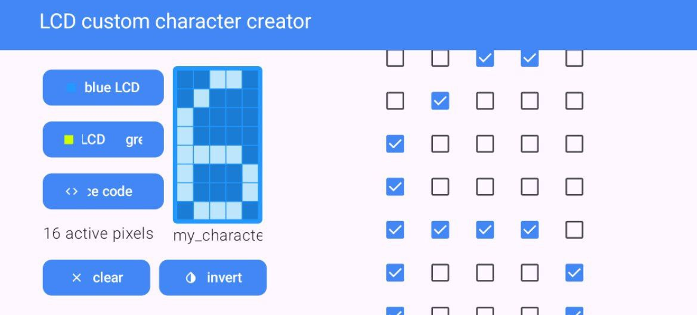
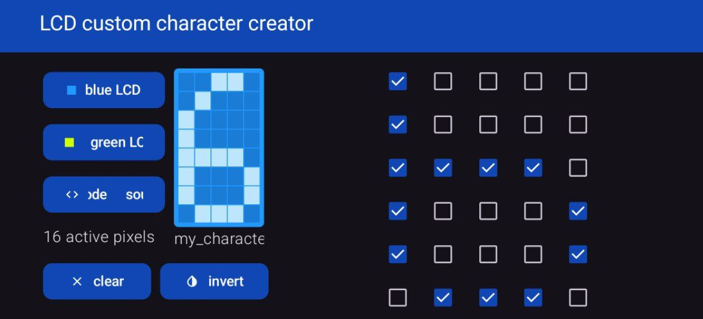

# LCD custom characters creator
A simple mobile tool on *Jetpack Compose* for LCD display custom characters creating, for Arduino.

## Suitable for arduino libs:
* **LiquidCrystal**
* **LiquidCrystalI2C**

## Gallery (vertical, light and dark themes)
<table>
    <tr>
        <td>
            
        </td>
        <td>
            
        </td>
        <td>
            
        </td>
        <td>
            
        </td>
        <td>
            
        </td>
        <td>
            
        </td>
    </tr>
</table>

## Gallery (horizontal, light and dark themes)
<table>
    <tr>
        <td>
            
        </td>
        <td>
            
        </td>
    </tr>
</table>

## Features:
* dynamic result preview
* source code generation
* convenient UI 

## Android versions
Android 8.0 and later 

## How to use?
To start creating custom character for your LCD display, use input panel with checkboxes. By checking a checkbox, you enable one pixel at a specific position, multiple such checked checkboxes determine the pixels used in your character. You can check the result by looking at a special preview stylized for the display. You can then view the characters's code(and copy to buffer) on **C++** - character's byte array in binary or hex type. Then you use it when working in **Arduino** libraries for LCD: **LiquidCrystal**, **LiquidCrystalI2C**.

### Additional functionality
There is additional functionality to make work easier. For example, if you want to see what a character would look like on a green LCD display, just press the "*green lcd*" button to change preview skin to green **1**. If you need to invert, click the "*invert*" button **2**. Need to clear all, press "*clear*" button.

<table>
    <tr>
        <td>
            
        </td>
        <td>
            
        </td>
    </tr>
    <tr>
        <td>
            <h3>1 green lcd</h3>
        </td>
        <td>
            <h3>2 invert pixels</h3>
        </td>
    </tr>
</table>

## License
This project is licensed under the [MIT License](LICENSE)
