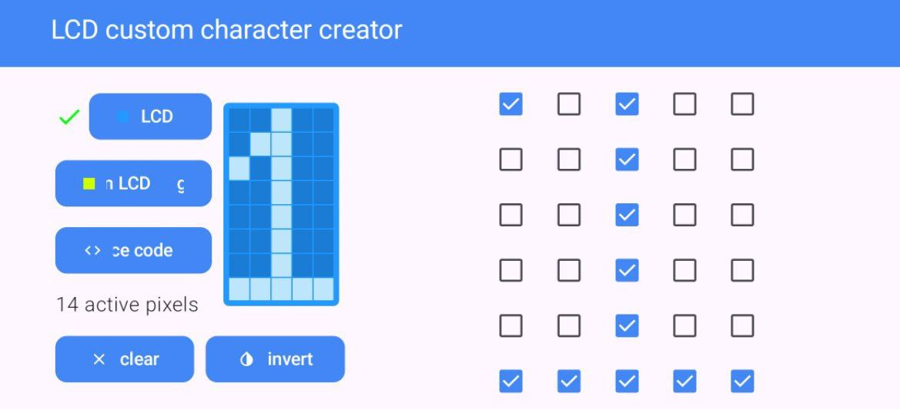
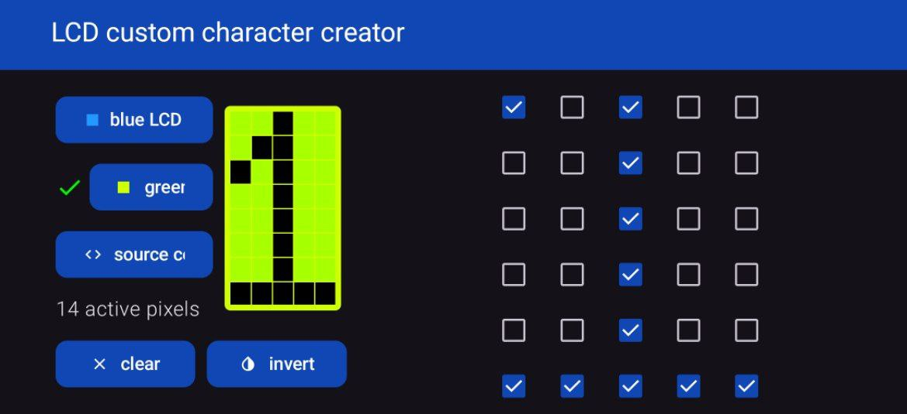

<h1 align="center">LCD custom characters creator</h1>
📱A simple mobile tool on *Jetpack Compose* for LCD display custom characters creating, for Arduino.

## 📁Suitable for arduino libs:
* **LiquidCrystal**
* **LiquidCrystalI2C**

## 🖼️Gallery (vertical, light and dark themes)
<table>
    <tr>
        <td>
            
        </td>
        <td>
            
        </td>
        <td>
            
        </td>
    </tr>
</table>

## 🖼️Gallery (horizontal, light and dark themes)
<table>
    <tr>
        <td>
            
        </td>
        <td>
            
        </td>
    </tr>
</table>

* 
⚠️pixel input panel is scrollable

## 🌟Features:
* dynamic result preview💻
* source code generation📥
* convenient UI📲

## 🔃Android versions
Android **8.0** and later 

## 📃How to use?
To start creating custom character for your LCD display, use input panel with checkboxes. By checking a checkbox, you enable one pixel at a specific position, multiple such checked checkboxes determine the pixels used in your character. You can check the result by looking at a special preview stylized for the display. You can then view the characters's code(and copy to buffer) on **C++** - **character's byte array in binary or hex type (See examples -> <a href="previews/source_code_examples.md">see</a>)**. Then you use it when working in **Arduino** libraries for LCD: **LiquidCrystal**, **LiquidCrystalI2C**.

### Additional functionality
There is additional functionality to make work easier. For example, if you want to see what a character would look like on a green LCD display, **just press the "*green lcd*" button to change preview skin to green**. **If you need to invert, click the "*invert*" button**. Need to clear all, press "*clear*" button.

## License
This project is licensed under the [MIT License](LICENSE)
